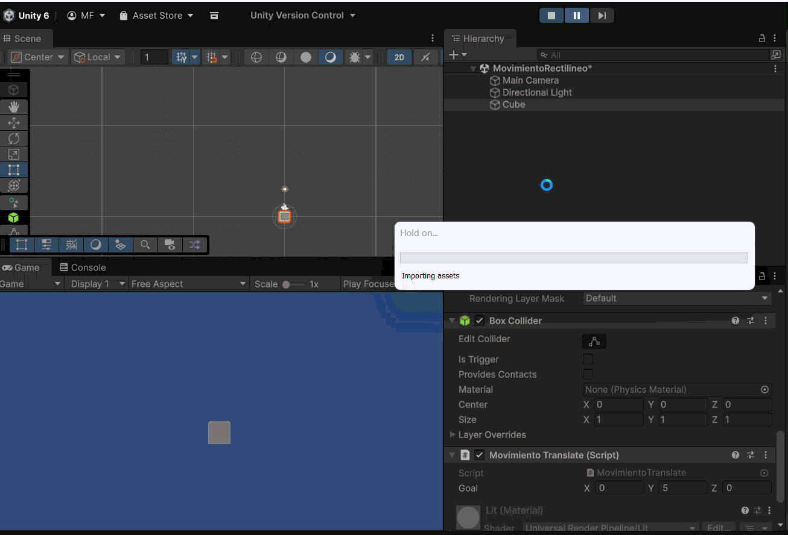
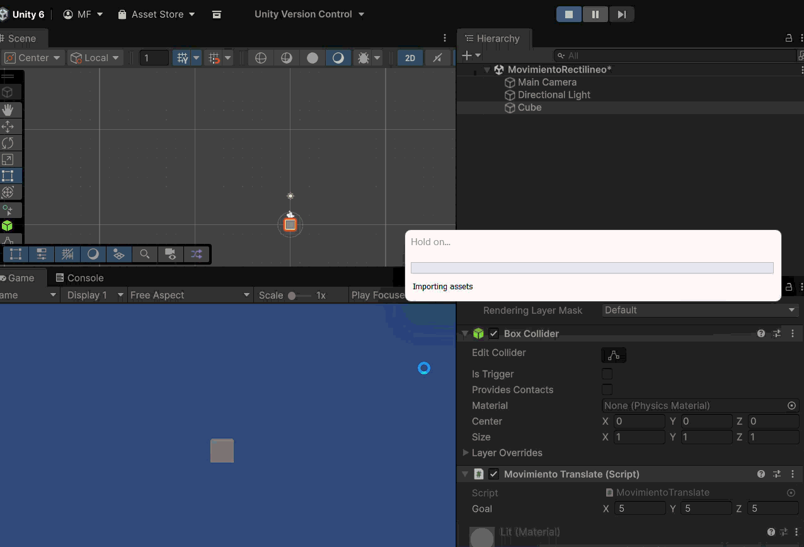

# Movimiento Rectilineo

## Ejercicio 1

Si pongo un vector goal muy grande (ej. 0, 0, 100), el objeto se mueve rapidísimo, y si el ordenador iba lento, el movimiento va a tirones.

## a

## b

## c

## d

## Ejercicio 2

## Ejercicio 3 y 4

## Ejercicio 5

## Ejercicio 6

Global

Local

## Ejercicio 7

## Ejercicio 8

## Ejercicio 9

